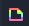

# Godot Dissolve Shader (Visual Shader)

Shader template for Godot Engine, implemented as visual shaders.
<p align="center">

</p>

## Usage
* Import ```src/dissolve-shader-template/project.godot``` in Godot
* Open the scene ```shaderDemo.tscn``` and look around the four examples

## Access each Visual Shader
* *Scene Editor:* Click on the example node whose shader you want to access, e.g. ```dissolve regular```
* *Inspector Window:* Expand ```> Material```
* Click on  to access the shaderMaterial
* Open the visualShader by clicking 

## Shader Details


* A scalar is multiplied with the uv coordinates to achieve scaling the dissolve effect, e.g. in the ```dissolve large``` example
* Another scalar is multiplied with the step threshold to make the emission texture a little larger than the alpha texture. This creates the green glowing border effect


## Good to know
* If you copy the shader to other object, but want the settings to be unique, click "make unique" at  BUT: You need to delete constants and add them again to make them unique too. I guess that's because of the exact variable names being copied. This is not self-explaining.
* If you want to directly create a noise texture in a ```texture node``` and select ```new NoiseTexture```, be aware that you need to edit it in the inspector and attach a ```simplexNoise``` first to make it all work.
* Be aware that the noise texture is not unique even if you make the visualShader unique. You need to replace the noiseTexture as well if you want to adjust it differently in copied shaders
